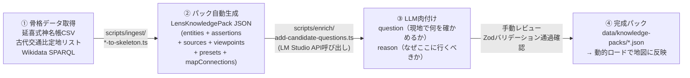
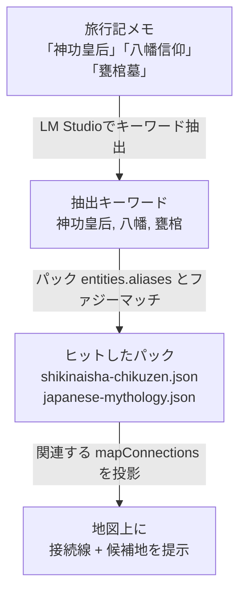

# 16. 外部ナレッジの体系的取り込み方針（骨格CSV → パック生成 → LLM肉付け → レビュー）

- **Status**: Accepted (Revised 2026-09-27)
- **Date**: 2026-09-27
- **Author**: Pair Programming Session
- **Supersedes**: 初版 ADR 0016（概念方針のみ）

## 文脈と課題 (Context & Problems)

旅行記のメモ（一次体験）からLENSを通じた接続線や未訪問候補地（フロンティア）を導出するためには、背後にある客観的な歴史・史料・神仏系譜などの「外部ナレッジ」が不可欠である。

しかし、古事記・日本書紀などの古典テキスト全文をそのまま取り込もうとすると、以下の問題が生じる：
1. **情報過多とノイズ**: 地図やLENSに必要な「点（座標・施設）」と「線（関係性・順序）」以外の記述が膨大で、抽出コストと誤認率が高い。
2. **位置・座標の不確実性**: 古典の記述には現代の緯度経度が含まれず、座標割り当てが困難。
3. **パック生成の重労働**: 現状の `LensKnowledgePack` スキーマ（entities, assertions, sources, viewpoints, presets, mapConnections, 全てZodバリデーション付き）は手動で書くと1パック数百行に達し、スケールしない。

## 決定事項 (Decisions)

### 基本方針：4段階パイプライン

外部ナレッジは、**体系化されたオープンデータを骨格にし、スクリプトで `LensKnowledgePack` を自動生成し、LM Studioで問い・理由を肉付けし、人間がレビューする** 4段階パイプラインで取り込む。



### 1. 骨格として活用する外部ナレッジソース

| LENS観点 | 最適な外部リソース | 取得方法 | 取得できる確定値 |
| :--- | :--- | :--- | :--- |
| **神・系譜 / 宗教** | 延喜式神名帳（式内社DB） | 國學院大神社史料統合DB / 国土数値情報CSV / Wikidata | 社名・祭神・旧国郡・現比定社・緯度経度（全2,861社・3,132座） |
| **ルート / 交通** | 古代交通比定地リスト | 文化庁史跡DB / 学術候補地リスト | 通過順序・距離・座標。魏志倭人伝比定地、古代駅家、巡礼路 |
| **人物 / 政治・社会** | Wikidata人物グラフ | SPARQL クエリ | 人物間の師弟・血縁・所属と活動拠点座標 |

### 2. パック生成スクリプトの具体設計

#### ディレクトリ構造

```
scripts/
  ingest/
    shikinaisha-to-skeleton.ts   # 延喜式神名帳CSV → LensKnowledgePack JSON
    wikidata-figures-to-skeleton.ts  # Wikidata SPARQL → 人物パック JSON
    ancient-routes-to-skeleton.ts    # 古代交通データ → ルートパック JSON
  enrich/
    add-candidate-questions.ts   # LM Studioで問い・理由を生成
  validate/
    validate-pack.ts             # Zodスキーマでの一括バリデーション

data/
  knowledge-packs/
    shikinaisha-chikuzen.json    # 筑前の式内社パック
    shikinaisha-buzen.json       # 豊前の式内社パック
    shikinaisha-aki.json         # 安芸の式内社パック
    wajinden-routes.json         # 既存パック（seed-packs.tsから移行）
    japanese-mythology.json      # 既存パック（seed-packs.tsから移行）
  skeletons/                     # 骨格CSVの中間生成物
    shikinaisha-raw.csv
```

#### 骨格CSV → パック生成の変換ルール

入力（延喜式神名帳の例）：

```csv
社名,祭神,旧国,旧郡,現比定社,緯度,経度,社格
志賀海神社,綿津見三神,筑前,糟屋,志賀海神社,33.6677,130.3158,名神大
宗像大社,宗像三女神,筑前,宗像,宗像大社辺津宮,33.8306,130.5138,名神大
```

出力（自動生成されるパック構造）：

```ts
// entities
{ id: "shikaga-jinja", kind: "place", label: "志賀海神社",
  coordinates: { latitude: 33.6677, longitude: 130.3158 } }
{ id: "watatsumi-triad", kind: "deity", label: "綿津見三神" }

// assertions
{ id: "enshrine-shikaga", subjectId: "watatsumi-triad",
  predicate: "enshrined_at", objectId: "shikaga-jinja",
  relationFamily: "enshrinement", nature: "reviewed-reference",
  sourceIds: ["engishiki"], viewpointIds: ["engishiki-view"],
  confidence: "high", reviewStatus: "reviewed" }

// mapConnections（訪問済み宗像大社と未訪問志賀海神社を結ぶ）
{ id: "munakata-shikaga-connection",
  placeEntityIds: ["munakata-taisha", "shikaga-jinja"],
  assertionIds: ["enshrine-shikaga", "enshrine-munakata"],
  ... }
```

### 3. LM Studio（ローカルLLM）の役割と具体的プロンプト

#### 担当範囲の明確な分離

| 担当 | 骨格データ（スクリプト） | LM Studio |
|---|---|---|
| 社名・地名 | ✅ 確定値として採用 | ❌ 生成しない |
| 緯度・経度 | ✅ CSV/Wikidataから | ❌ 生成しない |
| 祭神・人物関係 | ✅ 典拠付きで採用 | ❌ 生成しない |
| question（問い） | ❌ | ✅ 生成する |
| reason（理由） | ❌ | ✅ 生成する |

#### プロンプトテンプレート

```
あなたは知的好奇心旺盛な旅行者のためのガイドです。
以下の訪問済み神社と、まだ訪問していない関連する式内社について、
2つのテキストを各100文字以内で生成してください。

【訪問済み】
- 宗像大社辺津宮（筑前国宗像郡・名神大社、祭神: 宗像三女神、海上交通の守護）

【未訪問（候補地）】
- 志賀海神社（筑前国糟屋郡・名神大社、祭神: 綿津見三神、海人族・安曇氏の拠点）

【共通するつながり】
- 同じ筑前国の名神大社、海の神を祀る、古代海上交通の要衝

【出力形式】
question: 「現地で何を観察・確認すべきか」を一人称で
reason: 「なぜ訪問済みの場所と対比してここに行く価値があるのか」を
```

### 4. ナレッジパックのファイル分割戦略

現状の `seed-packs.ts`（68KB, 505行）に全パックが同居する問題を解消する。

#### 方針：エリア × LENS のサブセットで分割

全2,861社を一括で入れるのではなく、**ユーザーの訪問エリアや関心LENSに近い「サブセット」** から段階的に追加する：

| 優先度 | パック | 理由 |
|---|---|---|
| ★★★ | 筑前・豊前の式内社（約50社） | 訪問済みの宗像・宇佐エリアと直結 |
| ★★☆ | 安芸の式内社（約20社） | 訪問済みの宮島・弥山エリアと直結 |
| ★★☆ | 長門・周防の式内社（約15社） | 訪問済みの萩エリアと直結 |
| ★☆☆ | 壱岐・対馬の式内社（約60社） | 魏志倭人伝ルートの候補地と直結 |
| ☆☆☆ | 全国の名神大社（226社） | 全体俯瞰用（将来） |

#### ロード方式

```ts
// 既存の seed-packs.ts のハードコード → JSON 動的ロードへ移行
// apps/web/src/domain/lens-packs/pack-loader.ts
import { LensKnowledgePackSchema } from "./schema";

export async function loadKnowledgePack(packId: string) {
  const raw = await import(`@data/knowledge-packs/${packId}.json`);
  return LensKnowledgePackSchema.parse(raw.default);
}
```

> [!NOTE]
> 初期はビルド時に静的インポートでも良い。パック数が増えたら動的ロードに移行する。

### 5. 旅行記メモからの逆引き結合（オンデマンド拡張）

ユーザーが旅行記をインポートした際の逆引きフロー：



### 6. 知の循環ループにおける外部ナレッジの位置づけ

```
旅行記（一次体験・メモ）
  → 外部ナレッジ（体系知: 延喜式, Wikidata等）と照合
    → LENS / トピック決定（どの視点で見るか）
      → 接続線の構造化（lensId + topicId を持つ ReviewAtlasConnection）
        → 候補地の導出（question + reason を持つ ReviewExplorationSuggestion）
          → 次の旅へ
```
